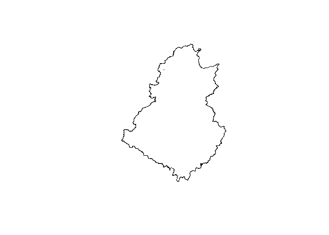

Trabalho 1 - Clima e Recursos Hidricos
================
17 de maio de 2021

#### Passo 1: download dos dados da Climatic Research Unit (CRU)

Os dados estimados de precipitacao da CRU sao disponibilizados online e podem ser baixados manualmente. Os dados mais recentes de precipitacao elaborados pela CRU (4.05) estao armazenados [nesse link](https://crudata.uea.ac.uk/cru/data/hrg/cru_ts_4.05/cruts.2103051243.v4.05/pre/). Os dados sao disponibilizados no formato netCDF, bastante comum para dados climaticos. Baixe o arquivo, descompacte e armazene na mesma pasta em que o codigo estiver salvo ou em uma pasta chamada dados.

Esse tutorial explica de forma bem completa como manusear arquivos NetCDF no R: <https://thiagodossantos.com/pt/post/2-raster_basic_operations/>

``` r
library(ncdf4)
library(raster)
library(rgdal)
library(dplyr)
library(R.utils)
```

``` r
url <- "https://crudata.uea.ac.uk/cru/data/hrg/cru_ts_4.05/cruts.2103051243.v4.05/pre/"
ncfname <- "dados/cru_ts4.05.1901.2020.pre.dat.nc.gz"
```

#### Passo 2: Leitura do arquivo netCDF

A partir das funcoes abaixo, eh possivel abrir e explorar o arquivo netCDF.

``` r
ncfname <- "dados/cru_ts4.05.1901.2020.pre.dat.nc"
ncin <- nc_open(ncfname)
t <- ncvar_get(ncin, "time")
tunits <- ncatt_get(ncin, "time", "units")
nt <- dim(t)
```

A unidade de tempo dos dados de precipitacao corresponde ao numero de dias apos 01/01/1901. Vamos converter para o formato padrao de data.

``` r
t_format <- lubridate::ymd("1900-01-01") + lubridate::days(t)
```

``` r
pre1.brick <- brick(ncfname)
extent(pre1.brick)
```

    ## class      : Extent 
    ## xmin       : -180 
    ## xmax       : 180 
    ## ymin       : -90 
    ## ymax       : 90

#### Passo 3: Cortar raster para a regiao de interesse

Leia o arquivo shapefile correspondente ao contorno da bacia de interesse. Sera necessario converter o sistema de coordenadas do shapefile para o mesmo sistema do raster com os dados de precipitacao.

``` r
shapefile <- readOGR("dados/36290000.shp")
```

    ## OGR data source with driver: ESRI Shapefile 
    ## Source: "C:\Users\usuário\Google Drive (taismaria@alu.ufc.br)\Doutorado\Disciplinas\2021.1\Clima e RH\Trabalho 1\dados\36290000.shp", layer: "36290000"
    ## with 1 features
    ## It has 1 fields

``` r
shapefile <- spTransform(shapefile, crs(proj4string(pre1.brick)))
plot(shapefile)
```



Agora, sera possivel fazer o recorte do raster a partir do shapefile da regiao de interesse.

``` r
pre1.mask <- crop(pre1.brick[[c(1:nt)]], shapefile)
```

#### Passo 4: Extracao da serie de precipitacao para a regiao de interesse

O ultimo passo eh a extracao da serie temporal de precipitacao para o recorte extraido no passo anterior. O valor da precipitacao mensal sera a media da precipitacao mensal dos pixels contidos no recorte.

``` r
pre1.df <- as.data.frame(pre1.mask)
pre1.df_mean <- pre1.df[complete.cases(pre1.df),] %>%
  summarise_all(mean)

prec <- data.frame(date = t_format, prec = as.numeric(pre1.df_mean))
```
